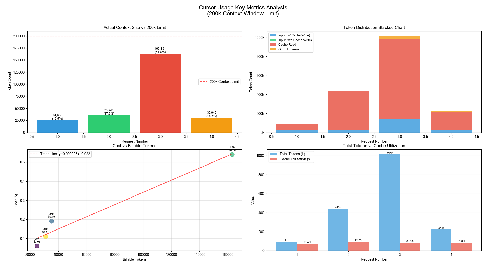
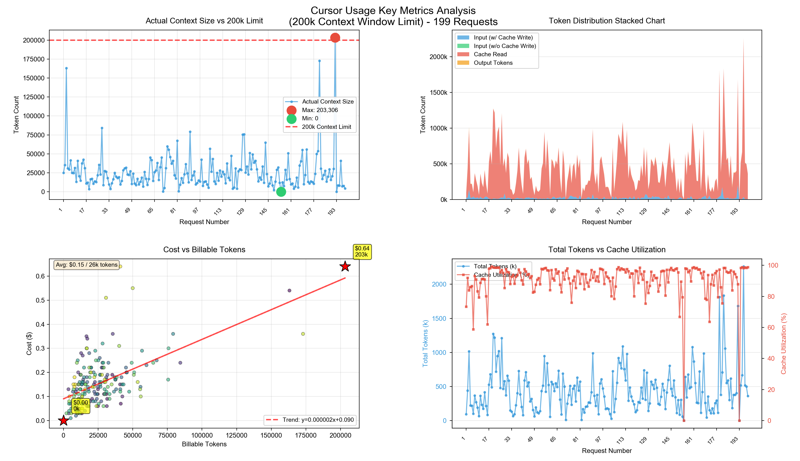

# cursor-usage

A Python tool for analyzing Cursor API usage data, providing comprehensive insights into context size, token distribution, costs, and cache utilization.


## Requirements

- Python 3.7+
- matplotlib >= 3.5.0
- numpy >= 1.21.0
- pandas >= 1.3.0


## Examples

### Example 1: Analyze a single CSV file
```bash
python3 cursor-usage/cursor-usage-analyze.py -c usage-events-2025-12-02-composer-1.csv
```

### Example 2: Use default sample data
```bash
python3 cursor-usage/cursor-usage-analyze.py
```

### Example 3: Analyze different model data
```bash
# Analyze composer-1 model usage
python3 cursor-usage/cursor-usage-analyze.py -c usage-events-2025-12-02-composer-1.csv

# Analyze auto model usage
python3 cursor-usage/cursor-usage-analyze.py -c usage-events-2025-12-02-auto.csv
```

**Usage example**





## Features

- **Context Size Analysis**: Visualize actual context usage against the 200k token limit
- **Token Distribution**: Stacked charts showing breakdown of input tokens, cache reads, and output tokens
- **Cost Analysis**: Scatter plots with trend lines showing cost vs billable tokens relationship
- **Cache Utilization**: Track and analyze cache hit rates and utilization percentages
- **Detailed Reports**: Generate comprehensive text reports with recommendations
- **Smart Visualization**: Automatically adapts visualization style based on data volume for optimal readability
- **Key Point Highlighting**: Automatically highlights maximum, minimum, and critical data points

## Installation

1. Clone this repository:
```bash
git clone https://github.com/yourusername/my-tools.git
cd my-tools
```

2. Install dependencies:
```bash
pip3 install -r requirements.txt
```

Or if you're using a virtual environment:
```bash
source .venv/bin/activate
pip install -r requirements.txt
```

## Usage

### Basic Usage

Run the script with sample data:
```bash
python3 cursor-usage/cursor-usage-analyze.py
```

### Using Custom Data

You can analyze data from a CSV file by passing it as a command-line argument:

```bash
# Using --csv flag
python3 cursor-usage/cursor-usage-analyze.py --csv usage-events-2025-12-02.csv

# Using short form -c flag
python3 cursor-usage/cursor-usage-analyze.py -c usage-events-2025-12-02.csv

# Using relative or absolute paths
python3 cursor-usage/cursor-usage-analyze.py -c cursor-usage/usage-events-2025-12-02-composer-1.csv
python3 cursor-usage/cursor-usage-analyze.py -c /path/to/your/data.csv
```

If no CSV file is provided, the script will use the default sample data (`SAMPLE_DATA`).

### Command-Line Options

```bash
python3 cursor-usage/cursor-usage-analyze.py --help
```

**Options:**
- `-c, --csv CSV_FILE`: Path to CSV file containing usage data. If not provided, uses default sample data.
- `-h, --help`: Show help message and exit

## Input Data Format

The script expects CSV data with the following columns:

- `Date`: Timestamp of the request (ISO 8601 format)
- `Kind`: Request kind (e.g., "Included")
- `Model`: Model used (e.g., "auto", "composer-1")
- `Max Mode`: Maximum mode setting (e.g., "No", "Yes")
- `Input (w/ Cache Write)`: Input tokens with cache write
- `Input (w/o Cache Write)`: Input tokens without cache write
- `Cache Read`: Number of tokens read from cache
- `Output Tokens`: Number of output tokens generated
- `Total Tokens`: Total tokens used
- `Cost`: Cost in dollars

**Example CSV:**
```csv
Date,Kind,Model,Max Mode,Input (w/ Cache Write),Input (w/o Cache Write),Cache Read,Output Tokens,Total Tokens,Cost
2025-12-02T01:46:34.592Z,Included,auto,No,21865,0,68608,3043,93516,0.06
2025-12-01T13:15:54.637Z,Included,auto,No,26134,0,404992,9107,440233,0.19
```

## Output

The script generates:

### 1. Visual Dashboard

A 2x2 grid of plots showing:

- **Actual Context Size vs 200k Limit**:
  - Line plot (for >20 data points) or bar chart (for ≤20 points)
  - Highlights maximum and minimum values
  - Shows percentage of context limit used

- **Token Distribution Chart**:
  - Area plot (for >20 data points) or stacked bar chart (for ≤20 points)
  - Breakdown of input tokens, cache reads, and output tokens

- **Cost vs Billable Tokens**:
  - Scatter plot with trend line
  - Highlights key points (max cost, min cost, max tokens)
  - Shows average statistics
  - Point size adjusts based on data volume

- **Total Tokens vs Cache Utilization**:
  - Dual y-axis line plot (for >20 points) or bar chart (for ≤20 points)
  - Compares total tokens and cache utilization percentage

### 2. Detailed Analysis Report

Text output including:

- **Summary Statistics Table**: Complete data table with calculated metrics
- **Context Size Analysis**: Status indicators for each request (✅ Safe, ⚠️ Approaching Limit, ❌ Exceeded Limit)
- **Cache Utilization Analysis**: Utilization status for each request
- **Cost Efficiency Metrics**: Average cost per 1k tokens, most/least expensive requests
- **Actionable Recommendations**:
  - Context usage optimization suggestions
  - Cache optimization recommendations


## Metrics Explained

- **Actual Context Size**: Sum of input tokens (with/without cache write) and output tokens
- **Billable Tokens**: Tokens that contribute to cost calculation, including 4 parts: (1) Input tokens with cache write, (2) Input tokens without cache write, (3) Cache read tokens (lower cost), and (4) Output tokens
- **Cache Utilization (%)**: Percentage of tokens served from cache vs total tokens
- **Context Usage (%)**: Percentage of the 200k context window being used

## Thresholds and Warnings

The tool uses the following thresholds for analysis:

- **Context Limit**: 200,000 tokens
- **Warning Threshold**: 180,000 tokens (90% of limit) - ⚠️ Approaching Limit
- **Safe Threshold**: 150,000 tokens (75% of limit) - ✅ Good
- **Cache Warning Threshold**: 20% - Warns if cache utilization is below this

## Recommendations

The tool provides automatic recommendations based on:

- **Context Usage**:
  - Warns when approaching the 200k limit (>90%) and suggests optimization
  - Suggests compressing input or reducing output length when near limit
  - Recommends increasing context when usage is low

- **Cache Utilization**:
  - Identifies low cache usage and suggests standardizing question patterns
  - Recommends optimizing question phrasing to improve cache hit rate

- **Cost Efficiency**:
  - Highlights most and least expensive requests for optimization
  - Shows average cost per 1k tokens for cost planning


