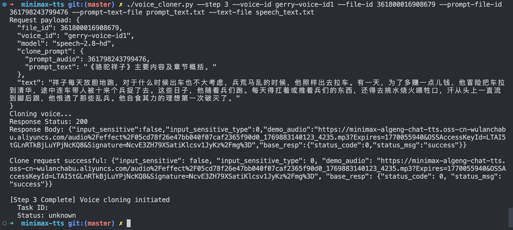

# MiniMax TTS Voice Cloning Tool

A Python library for voice cloning and text-to-speech synthesis using the MiniMax API.

## Features

- **Voice Cloning**: Upload reference audio to clone specific voices
- **Text-to-Speech**: Convert text to speech using cloned or built-in voices
- **Synchronous & Async**: Support for both sync and async TTS operations
- **Task Management**: Query task status and retrieve generated audio
- **File Management**: List, query, and delete uploaded audio files
- **Multi-Format Config**: Support for .env, JSON, and INI configuration files
- **CLI Support**: Command-line interface for quick testing and scripting

## Requirements

- Python 3.7+
- requests
- python-dotenv (optional, for .env file support)

## Installation

```bash
# Clone or copy the project
git clone <repository-url>
cd minimax-tts

# Install dependencies
pip install requests python-dotenv
```

## Configuration

Set your MiniMax API key. Create a `.env` file in the project directory:

```bash
MINIMAX_API_KEY=your-api-key-here
```

Or set it as an environment variable:

```bash
export MINIMAX_API_KEY="your-api-key-here"
```

## Quick Start

### Basic Voice Cloning

```python
from voice_cloner import VoiceCloner

cloner = VoiceCloner()

# Clone a voice from reference audio
result = cloner.clone_voice(
    voice_id="my_voice",
    audio_path="/path/to/reference_audio.mp3"
)
```

### With Prompt Audio for Enhanced Quality

```python
result = cloner.clone_voice(
    voice_id="my_voice",
    audio_path="/path/to/reference_audio.mp3",
    prompt_audio="/path/to/prompt_audio.mp3",
    prompt_text="Text spoken in the prompt audio"
)
```

### Text-to-Speech with Cloned Voice

```python
# Synchronous TTS (up to 10,000 characters)
audio_url = cloner.text_to_speech(
    text="Hello, this is a test.",
    voice_id="my_voice"
)
```

### Async TTS for Long Text

```python
# Async TTS for longer content
task_id = cloner.text_to_speech_async(
    text="Long text content here...",
    voice_id="my_voice"
)

# Check task status
status = cloner.get_task_status(task_id)
if status.status == "completed":
    audio_url = status.audio_url
```

### File Management

Manage your uploaded audio files:

```python
# List all uploaded files
files = cloner.list_files()
for f in files:
    print(f"ID: {f['file_id']}, Name: {f['filename']}")

# List only voice clone files
clone_files = cloner.list_files(purpose="voice_clone")

# Get detailed info about a specific file
file_info = cloner.get_file_info("123456789")
print(f"Filename: {file_info['filename']}")
print(f"Size: {file_info['bytes'] / 1024:.2f} KB")

# Delete a file
success = cloner.delete_file("123456789")
if success:
    print("File deleted successfully")
```

## Example

Below is a successful voice cloning and text-to-speech conversion example:



The example demonstrates:
- Reference audio upload and voice cloning
- Prompt audio for enhanced voice quality
- Text-to-speech conversion using the cloned voice
- Generated audio output saved as `speech.mp3` with the cloned voice characteristics

## Command Line Usage

```bash
# Clone a voice
python voice_cloner.py \
    --voice-id my_voice \
    --audio /path/to/sample.mp3

# Text-to-speech
python voice_cloner.py \
    --voice-id my_voice \
    --text "要转换的文本内容" \
    --output result.mp3
```

### Step-by-Step Workflow

```bash
# Step 1: Upload reference audio and get file_id
python voice_cloner.py --step 1 --audio reference.m4a

# Step 2: Upload prompt audio for enhanced quality (optional)
python voice_cloner.py --step 2 --prompt-audio prompt.m4a --file-id <file_id_from_step1>

# Step 3: Complete voice cloning (basic)
python voice_cloner.py --step 3 --voice-id my_voice --file-id <file_id>
```

### File Management Commands

```bash
# List all uploaded files
python voice_cloner.py --list-files

# List only voice clone files
python voice_cloner.py --list-files --purpose voice_clone

# List only prompt audio files
python voice_cloner.py --list-files -u prompt_audio

# Get detailed info about a specific file
python voice_cloner.py --get-file-info 123456789

# Delete a specific file (will prompt for confirmation)
python voice_cloner.py --delete-file 123456789

# Output in JSON format
python voice_cloner.py --list-files --json
python voice_cloner.py --get-file-info 123456789 --json
```

## Supported Audio Formats

| Type | Formats | Max Size | Duration |
|------|---------|----------|----------|
| Reference Audio | mp3, m4a, wav | 20MB | 10s - 5min |
| Prompt Audio | mp3, m4a, wav | 20MB | < 8s |

## API Reference

### VoiceCloner

#### Core Methods

| Method | Description |
|--------|-------------|
| `clone_voice()` | Clone a voice from reference audio |
| `text_to_speech()` | Synchronous TTS conversion |
| `text_to_speech_async()` | Async TTS for long text |
| `get_task_status()` | Query async task status |
| `generate_audio_from_task()` | Get audio from completed task |

#### File Management Methods

| Method | Description |
|--------|-------------|
| `list_files(purpose=None)` | List all uploaded files, optionally filtered by type |
| `get_file_info(file_id)` | Get detailed information about a specific file |
| `delete_file(file_id)` | Delete an uploaded file |
| `upload_clone_audio(audio_path)` | Upload reference audio and get file_id |
| `upload_prompt_audio(audio_path)` | Upload prompt audio and get file_id |
| `clone_voice_with_file_id()` | Clone voice using pre-obtained file_id |

### Result Classes

- `VoiceCloneResult`: Contains task_id, status, audio_url
- `MiniMaxAPIError`: Custom exception for API errors

## Documentation

See [USAGE.md](USAGE.md) for detailed documentation, examples, and best practices.

## License

MIT
