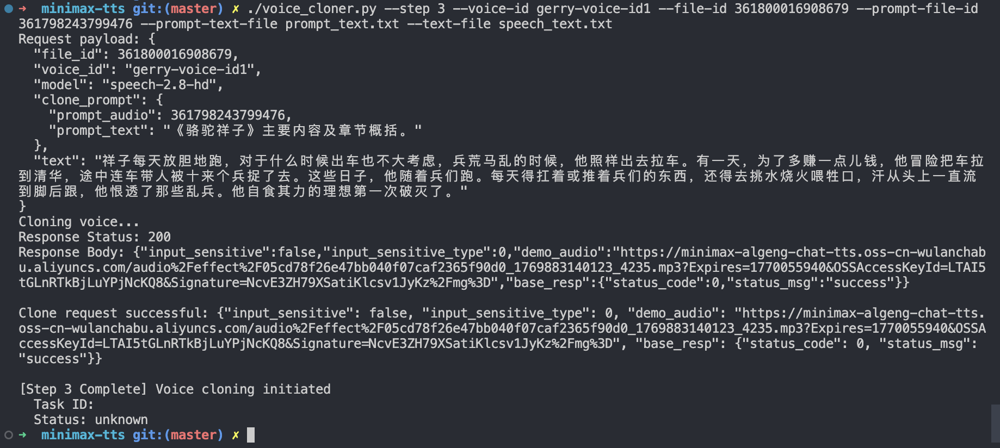

# MiniMax TTS Voice Cloning Tool

A Python library for voice cloning and text-to-speech synthesis using the MiniMax API.

## Project layout

| Path | Role |
|------|------|
| `voice_cloner` | Executable launcher at the repo root; runs `scripts/voice_cloner.py` with `minimax-tts/.venv` |
| `scripts/voice_cloner.py` | Library and CLI implementation (`VoiceCloner`, `main`) |
| `install.sh` | Creates `.venv`, installs `requirements.txt`, optional `.env` from `.env.example` |
| `requirements.txt` | Locked dependencies (`requests`, `urllib3`, …) |

Run CLI commands from the **`minimax-tts`** directory so `./voice_cloner` and `.venv` resolve correctly.

## Features

- **Voice Cloning**: Upload reference audio to clone specific voices
- **Text-to-Speech**: Convert text to speech using cloned or built-in voices
- **Synchronous & Async**: Support for both sync and async TTS operations
- **Task Management**: Query task status and retrieve generated audio
- **File Management**: List, query, and delete uploaded audio files
- **Multi-Format Config**: Support for .env, JSON, and INI configuration files
- **CLI Support**: Command-line interface for quick testing and scripting

## Requirements

- **Python** 3.7 or newer (3.9+ recommended; matches Apple/Xcode toolchains many developers use)
- **Dependencies** declared in [`requirements.txt`](requirements.txt) (`requests`, `urllib3`, etc.)

## Installation

From the **`minimax-tts`** directory:

```bash
chmod +x install.sh voice_cloner   # first clone only, if needed
./install.sh
```

This creates **`minimax-tts/.venv`**, installs packages from **`requirements.txt`**, and—if you do not already have one—copies **`.env.example`** to **`.env`** for you to edit.

**Manual install** (optional):

```bash
python3 -m venv .venv
source .venv/bin/activate   # Windows: .venv\Scripts\activate
pip install -r requirements.txt
```

## Configuration

Set your MiniMax API key. After `./install.sh`, edit **`.env`** in **`minimax-tts`** (or create it yourself):

```bash
MINIMAX_API_KEY=your-api-key-here
```

Or set an environment variable:

```bash
export MINIMAX_API_KEY="your-api-key-here"
```

The bundled tool reads keys from `.env` using its own parser; you do **not** need the `python-dotenv` package for that.

### Speech model (`--model`)

The **`POST /v1/voice_clone`** API accepts only the **`model` enum** listed in the **[Voice Clone API](https://platform.minimaxi.com/docs/api-reference/voice-cloning-clone)** docs — for example **`speech-2.8-hd`**, **`speech-2.8-turbo`**, **`speech-2.6-hd`**, etc. There is **no** bare **`speech-2.8`** string.

This tool defaults to **`speech-2.8-hd`** (official OpenAPI example). Use **`--model speech-2.8-turbo`** for the Turbo variant. Speech quotas under **[Token Plan](https://platform.minimaxi.com/docs/token-plan/intro)** apply separately from the exact model id string.

If the API returns **`insufficient balance`** (**1008**) or other **`base_resp`** errors, check billing and key type in the console.

## Quick Start

### Basic Voice Cloning

```python
import sys
sys.path.insert(0, "/path/to/minimax-tts/scripts")  # directory containing voice_cloner.py

from voice_cloner import VoiceCloner

cloner = VoiceCloner()

# Clone a voice from reference audio
result = cloner.clone_voice(
    voice_id="my_voice",
    audio_path="/path/to/reference_audio.mp3"
)
```

### With Prompt Audio for Enhanced Quality

```python
import sys
sys.path.insert(0, "/path/to/minimax-tts/scripts")
from voice_cloner import VoiceCloner

result = cloner.clone_voice(
    voice_id="my_voice",
    audio_path="/path/to/reference_audio.mp3",
    prompt_audio="/path/to/prompt_audio.mp3",
    prompt_text="Text spoken in the prompt audio"
)
```

### Text-to-Speech with Cloned Voice

```python
import sys
sys.path.insert(0, "/path/to/minimax-tts/scripts")
from voice_cloner import VoiceCloner

cloner = VoiceCloner()

# Synchronous TTS (up to 10,000 characters)
audio_url = cloner.text_to_speech(
    text="Hello, this is a test.",
    voice_id="my_voice"
)
```

### Async TTS for Long Text

```python
import sys
sys.path.insert(0, "/path/to/minimax-tts/scripts")
from voice_cloner import VoiceCloner

cloner = VoiceCloner()

task_id = cloner.text_to_speech_async(
    text="Long text content here...",
    voice_id="my_voice"
)

status = cloner.get_task_status(task_id)
if status.status == "completed":
    audio_url = status.audio_url
```

### File Management

Manage your uploaded audio files:

```python
import sys
sys.path.insert(0, "/path/to/minimax-tts/scripts")
from voice_cloner import VoiceCloner

cloner = VoiceCloner()

# List all uploaded files
files = cloner.list_files()
for f in files:
    print(f"ID: {f['file_id']}, Name: {f['filename']}")

# List only voice clone files
clone_files = cloner.list_files(purpose="voice_clone")

# Get detailed info about a specific file
file_info = cloner.get_file_info("123456789")
print(f"Filename: {file_info['filename']}")
print(f"Size: {file_info['bytes'] / 1024:.2f} KB")

# Delete a file
success = cloner.delete_file("123456789")
if success:
    print("File deleted successfully")
```

## Example

Below is a successful voice cloning and text-to-speech conversion example:



The example demonstrates:
- Reference audio upload and voice cloning
- Prompt audio for enhanced voice quality
- Text-to-speech conversion using the cloned voice
- Generated audio output saved as `speech.mp3` with the cloned voice characteristics

## Command Line Usage

Use **`./voice_cloner`** from the **`minimax-tts`** folder so it picks up **`./.venv`**. You do not need to activate the virtual environment first.

On **macOS**, a bare `python` command is often missing from `PATH`; prefer `./voice_cloner` or, after `source .venv/bin/activate`, the `python` inside the venv.

### `--voice-id` (`-v`)

You define this string yourself—it labels your cloned voice and is **not** assigned by the API. Naming rules: **8–256** characters, **start with a letter**, only letters/digits/`_`/`-` in the middle, **end with a letter or digit**. Examples: `my_voice_01`, `Scarlett_EN`. Full rules and counterexamples: `./voice_cloner --help`. More detail: [USAGE.md](USAGE.md) (Command line usage → `--voice-id`).

```bash
# Clone a voice
./voice_cloner \
    --voice-id my_voice \
    --audio /path/to/sample.mp3

# Text-to-speech
./voice_cloner \
    --voice-id my_voice \
    --text "要转换的文本内容" \
    --output result.mp3
```

### Step-by-Step Workflow

```bash
# Step 1: Upload reference audio and get file_id
./voice_cloner --step 1 --audio reference.m4a

# Step 2: Upload prompt audio for enhanced quality (optional)
./voice_cloner --step 2 --prompt-audio prompt.m4a --file-id <file_id_from_step1>

# Step 3: Complete voice cloning (basic)
./voice_cloner --step 3 --voice-id my_voice --file-id <file_id>
```

### File Management Commands

```bash
# List all uploaded files
./voice_cloner --list-files

# List only voice clone files
./voice_cloner --list-files --purpose voice_clone

# List only prompt audio files
./voice_cloner --list-files -u prompt_audio

# Get detailed info about a specific file
./voice_cloner --get-file-info 123456789

# Delete a specific file (will prompt for confirmation)
./voice_cloner --delete-file 123456789

# Output in JSON format
./voice_cloner --list-files --json
./voice_cloner --get-file-info 123456789 --json
```

## Supported Audio Formats

| Type | Formats | Max Size | Duration |
|------|---------|----------|----------|
| Reference Audio | mp3, m4a, wav | 20MB | 10s - 5min |
| Prompt Audio | mp3, m4a, wav | 20MB | < 8s |

## API Reference

### VoiceCloner

#### Core Methods

| Method | Description |
|--------|-------------|
| `clone_voice()` | Clone a voice from reference audio |
| `text_to_speech()` | Synchronous TTS conversion |
| `text_to_speech_async()` | Async TTS for long text |
| `get_task_status()` | Query async task status |
| `generate_audio_from_task()` | Get audio from completed task |

#### File Management Methods

| Method | Description |
|--------|-------------|
| `list_files(purpose=None)` | List all uploaded files, optionally filtered by type |
| `get_file_info(file_id)` | Get detailed information about a specific file |
| `delete_file(file_id)` | Delete an uploaded file |
| `upload_clone_audio(audio_path)` | Upload reference audio and get file_id |
| `upload_prompt_audio(audio_path)` | Upload prompt audio and get file_id |
| `clone_voice_with_file_id()` | Clone voice using pre-obtained file_id |

### Result Classes

- `VoiceCloneResult`: Contains task_id, status, audio_url
- `MiniMaxAPIError`: Custom exception for API errors

## Documentation

See [USAGE.md](USAGE.md) for detailed documentation, examples, and best practices.

## License

MIT
