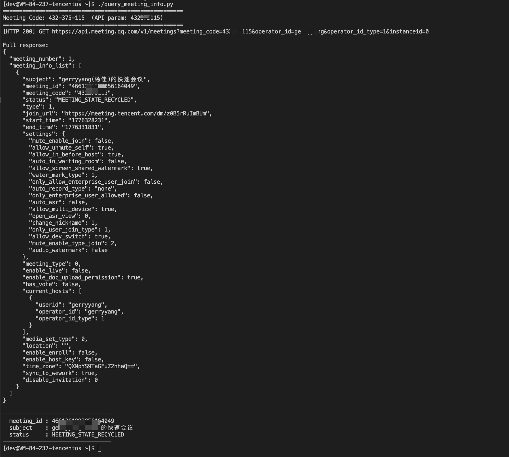

# Tencent Meeting API example: query `meeting_id` by Meeting Code

`query_meeting_info.py` demonstrates how to call the Tencent Meeting REST API to query meeting information by **Meeting Code** (e.g. `xxx-xxx-xxx`) and extract `meeting_id` from the response.

Official docs:

- [List meetings / query by meeting_code](https://cloud.tencent.com/document/product/1095/93432)
- [Signature method](https://cloud.tencent.com/document/product/1095/42413)

## Prerequisites

- Python 3 (standard library only; no `pip install` needed)
- A Tencent Meeting Open Platform app with **SecretId / SecretKey** (and **AppId** if required by your org/app)
- The `operator_id` must be a valid member of your organization (required for authentication)

## Environment variables

| Name | Required | Notes |
|------|----------|-------|
| `TENCENT_MEETING_MEETING_CODE` | Yes | Meeting Code. Can be UI format **`xxx-xxx-xxx`** or digits-only **`xxxxxxxxx`** (the script removes dashes/spaces before calling the API). |
| `TENCENT_MEETING_SECRET_ID` | Yes | Open Platform SecretId |
| `TENCENT_MEETING_SECRET_KEY` | Yes | Open Platform SecretKey |
| `TENCENT_MEETING_OPERATOR_ID` | Yes | Operator ID (meaning depends on `operator_id_type`) |
| `TENCENT_MEETING_APP_ID` | Depends | Organization AppId (if your app/org requires it) |
| `TENCENT_MEETING_SDK_ID` | No | App SdkId (optional; can be empty) |
| `TENCENT_MEETING_OPERATOR_ID_TYPE` | No | `1`=userid, `2`=openid, `3`=rooms_id (default `1`) |
| `TENCENT_MEETING_INSTANCE_ID` | No | Client type (e.g. `0` for PC; default `0`) |
| `TENCENT_MEETING_BASE_URL` | No | API base URL (default `https://api.meeting.qq.com`) |
| `TENCENT_MEETING_HTTP_TIMEOUT` | No | HTTP timeout in seconds (default `10`) |

`query_meeting_info.py` **does not store any secrets, account identifiers, or meeting codes in source**. You must provide the required values via environment variables (or a local `.env` file), otherwise the script exits with an error.

## Local setup (recommended)

1. Create `tencent-meeting/.env` locally (**do not commit it**; this repo ignores `tencent-meeting/.env`).
2. Use `KEY=value` format, one per line. Do **not** prefix with `export`.
   You can start by copying `tencent-meeting/.env.example` to `tencent-meeting/.env`.

Example (replace placeholders with your real values):

```env
TENCENT_MEETING_MEETING_CODE=xxx-xxx-xxx
TENCENT_MEETING_SECRET_ID=<your SecretId>
TENCENT_MEETING_SECRET_KEY=<your SecretKey>
TENCENT_MEETING_OPERATOR_ID=<your operator id>
TENCENT_MEETING_APP_ID=<your AppId>
TENCENT_MEETING_SDK_ID=<your SdkId (optional)>
# Optional:
# TENCENT_MEETING_OPERATOR_ID_TYPE=1
# TENCENT_MEETING_INSTANCE_ID=0
# TENCENT_MEETING_BASE_URL=https://api.meeting.qq.com
# TENCENT_MEETING_HTTP_TIMEOUT=10
```

Load `.env` into your shell and run:

```bash
cd tencent-meeting
set -a && source .env && set +a
python3 query_meeting_info.py
```

Or execute directly (the file is executable in this repo):

```bash
./query_meeting_info.py
```

If you already export variables in your shell profile, you can simply run:

```bash
python3 query_meeting_info.py
```

## Debug in Cursor / VS Code

If you have a local `.vscode/launch.json`, you can debug with:

- Configuration name: **Tencent Meeting: query_meeting_info.py**
- Uses `envFile` to load `tencent-meeting/.env` (so secrets stay out of `launch.json`).

## Changing the Meeting Code

Set `TENCENT_MEETING_MEETING_CODE` to either `xxx-xxx-xxx` UI format or digits-only; the script normalizes it before the request.

## Output

- On success, it prints HTTP status, the full JSON response, and extracts `meeting_id`, `subject`, and `status` from `meeting_info_list` / `meeting_list`.
- If the list is empty, it prints `error_code` and message from the API response. Refer to the official docs to troubleshoot auth/permissions/parameters.

## Example



## Security

- Treat SecretId/SecretKey as sensitive. Keep them in a local `.env` or secure secret store.
- If secrets were exposed, rotate them in the Open Platform console.
